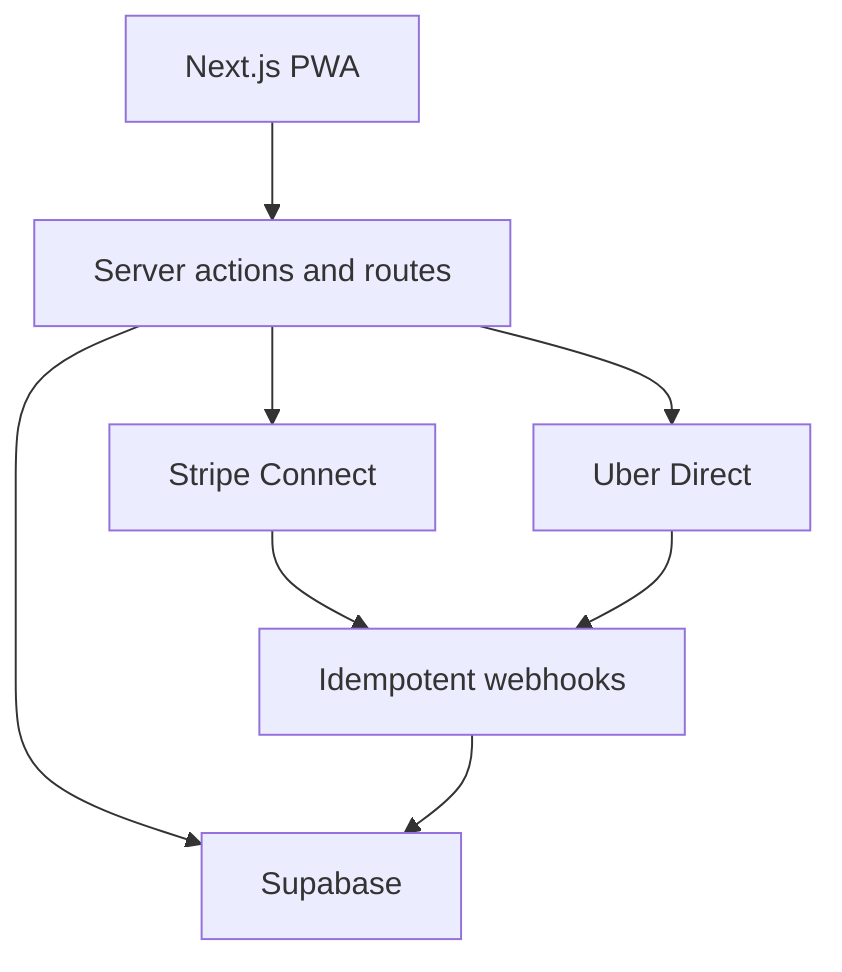

# MVP architecture

## System shape

The product is a mobile-first progressive web app. Next.js serves the UI and server-only integration routes. Supabase owns authentication, Postgres, row-level security, and file storage. Stripe Connect and Uber Direct enter in later sprints through isolated server adapters.

## Domain boundaries

- **Identity:** users, profiles, restaurant organizations, and role memberships.
- **Surplus:** seller-originated listings available over a defined window.
- **SOS:** buyer-originated same-day requests and seller offers.
- **Orders:** one shared checkout and fulfillment pipeline for accepted listings and SOS offers.
- **Delivery:** provider-neutral delivery interface backed by Uber Direct for MVP.

Sprint 1 implements only Identity plus the authenticated application shell. The other domains remain explicit extension points so later work does not require reorganizing the repository.

## Security baseline

- Browser code receives only the Supabase project URL and anon key.
- Provider secrets and the Supabase service-role key never use a `NEXT_PUBLIC_` prefix.
- Database access is organization-scoped through row-level security.
- Authentication checks use `getUser()`, which validates the session with Supabase Auth.
